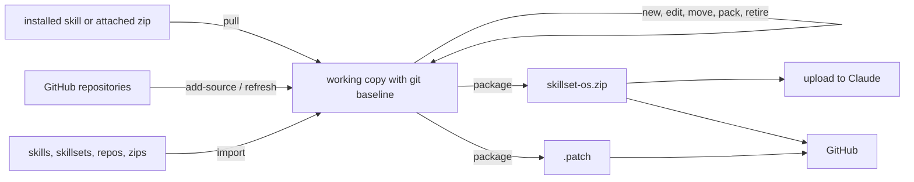

# Architecture

The repository is one Agent Skill. Claude loads it in stages. First it sees the top description, always. When the skillset is chosen, it reads the top router `SKILL.md`, then each nested `SKILLSET.md` router on the route. Finally it reads the chosen `SUBSKILL.md` and its resources. `skillset.py open` extracts packed members on the way.

| Component | Responsibility |
|---|---|
| `SKILL.md` | Top router: generated description and member table, plus how to navigate |
| `subskills/<name>/SUBSKILL.md` | A sub-skill's instructions, with `trigger`, `description` and `metadata.version` |
| `subskills/<name>/SKILLSET.md` | A nested skillset's router: authored description and trigger, generated table |
| `subskills/<name>.zip` | A packed member: skill, skillset or repository (may contain zips). Storage, not a skill: Claude never loads a zip, so it is read with `skillset.py open` where code execution is on |
| `skillsets.json` | Linked GitHub repositories and trigger overrides for packed members |
| `scripts/routing_eval.py` | blind routing sheet and scoring against `tests/routing.json` |
| `scripts/skillset.py` | check, index, tree, open, new, new-set, bump, replace, build, rename, move, retire, pack, unpack, import, add-source, refresh, pull, package |
| `scripts/templates/` | Member templates, and sources for the generated dotfiles |
| `tests/` | Tests for the tooling and for the skillset itself |

## Content layout

The content is layered so each idea has one home:

| Layer | Skillsets | Holds |
|---|---|---|
| Practical | `self-improvement`, `interpersonal`, `software-dev` | step-by-step methods for concrete situations |
| Faculties | `cognition` (ten groups) | the underlying mental faculties, each applied to people and to Claude |
| Maintenance | `skillset-tools`, `sync-skillset` | changing, learning into and packaging the skillset |

Practical members point to the faculty behind them; faculty members point to the practical member for situations. Group descriptions stay under 600 characters because each is repeated in its parent's router; `tests/test_structure.py` enforces this.

