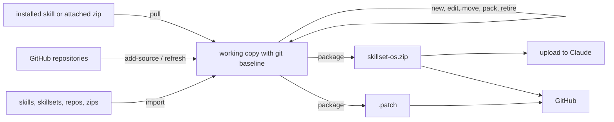

# Architecture

The repository is one Agent Skill. Claude loads it in stages. First it sees the top description, always. When the skillset is chosen, it reads the top router `SKILL.md`, then each nested `SKILLSET.md` router on the route. Finally it reads the chosen `SUBSKILL.md` and its resources. `skillset.py open` extracts packed members on the way.

| Component | Responsibility |
|---|---|
| `SKILL.md` | Top router: generated description and member table, plus how to navigate |
| `subskills/<name>/SUBSKILL.md` | A sub-skill's instructions, with `trigger`, `description` and `metadata.version` |
| `subskills/<name>/SKILLSET.md` | A nested skillset's router: authored description and trigger, generated table |
| `subskills/<name>.zip` | A packed member: skill, skillset or repository (may contain zips). Storage, not a skill: Claude never loads a zip, so it is read with `skillset.py open` where code execution is on |
| `skillsets.json` | Linked GitHub repositories and trigger overrides for packed members |
| `scripts/routing_eval.py` | blind routing sheet, scoring with a confusion matrix, rapid-route baseline and comparison, against `tests/routing.json` |
| `scripts/skillset.py` | check, index, tree, open, new, new-set, bump, replace, build, rename, move, retire, pack, unpack, import, add-source, refresh, pull, package |
| `scripts/templates/` | Member templates, and sources for the generated dotfiles |
| `tests/` | Tests for the tooling and for the skillset itself |

## Content layout

The content is layered so each idea has one home:

| Layer | Skillsets | Holds |
|---|---|---|
| Practical | `self-improvement`, `interpersonal`, `software-dev` | step-by-step methods for concrete situations |
| Faculties | `cognition` (ten groups) | the underlying mental faculties, each applied to people and to Claude |
| Maintenance | `skillset-tools`, `sync-skillset` | changing, learning into and packaging the skillset |

Practical members point to the faculty behind them; faculty members point to the practical member for situations. Group descriptions stay under 600 characters because each is repeated in its parent's router; `tests/test_structure.py` enforces this.

## Design principles

These invariants decide between competing changes. Claude's built-in values and Anthropic's guidelines, and the person's authority over the skillset, sit above them.

1. **Outcome ownership beats keyword overlap.** Route to the member that owns the result, in the order the top router gives.
2. **Reuse before creation.** Before adding a member, check whether an existing one can do the job, be extended, or compose with another. A failure is diagnosed (no member, weak member, wrong route, bad execution, tool or model limit, missing knowledge) before anything is added.
3. **Evidence beats assumption.** A change earns its place through a measurement, a test or a blind grade, not through looking more sophisticated. Designs and experiments stay proposals until then.
4. **Measure before redesigning.** Profile where the cost actually is; the cheapest fix that removes it wins over a new layer.
5. **Performance and maintainability are budgets.** A change may spend them only for a demonstrated quality gain; the same quality at higher cost is a regression.
6. **Change surface over file count.** Judge structure by how many files one coherent change touches. Merge artefacts that share a responsibility and split ones that mix several; never merge only to look smaller.
7. **Keep history, compress the active view.** Memory and artefacts are superseded, archived or merged with provenance, never silently deleted or rewritten.
8. **Verify separately when the stakes justify it,** and let the check disagree with the work.
9. **Say how sure you are.** Keep what is measured apart from what is inferred or assumed.
10. **Know when not to use the machinery.** The cheapest sufficiently reliable path to the outcome is the right one, including answering without the skillset.
